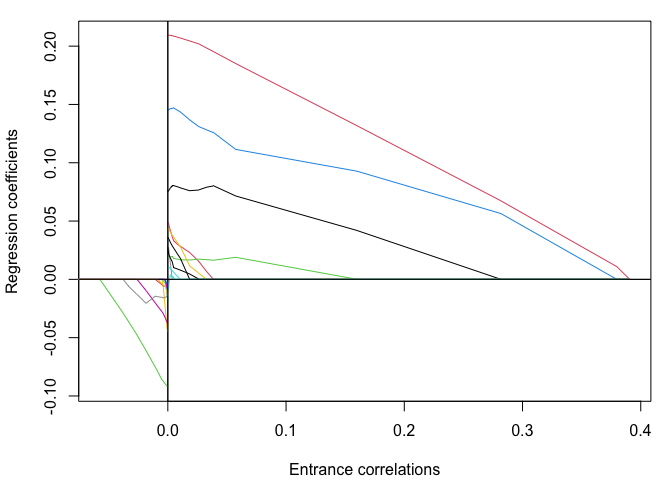
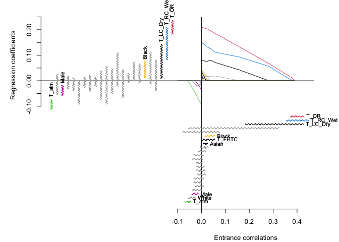

# The larinf package

Perform least angle regression inference with the bootstrap.

<!-- This is an R package which accompanies the paper: -->
<!-- Gregory, K. and Nordman, D. (2025+). Least angle regression inference. *In progress* -->
<!-- Find the paper on the page https://imstat.org/journals-and-publications/annals-of-statistics/annals-of-statistics-future-papers/ -->

Install with the R commands:

    install.packages("devtools")
    devtools::install_github("gregorkb/larinf")

See the package documentation for details.

# Illustration on example data set

Compute and plot the least angle regression path for the response vector
and design matrix in the data set `facetemp`, which is included in the
`larinf` package:

    data(facetemp)
    X <- facetemp$X
    y <- facetemp$y

    lar_out <- lar(X,y)
    plot(lar_out)

Obtain bootstrap confidence intervals for the entrance correlations and
make a plot comparing inference on the least angle regression entrance
correlations to classical inference on the regression coefficients:

    larinf_out <- larinf(X,y)
    plot(larinf_out,omaadd=c(0,0,1,1))

Print the estimated entrance correlations with 95% confidence intervals:

    larinf_out

    ## In order of entrance:
    ## 
    ##           Entrance correlation   2.5%  97.5%
    ## T_OR                     0.391  0.371  0.430
    ## T_RC_Wet                 0.380  0.355  0.450
    ## T_LC_Dry                 0.282  0.182  0.428
    ## T_RC_Dry                 0.160 -0.056  0.326
    ## T_atm                   -0.057 -0.069 -0.044
    ## T_LC_Wet                 0.038 -0.079  0.078
    ## White                   -0.038 -0.056 -0.024
    ## Black                    0.033  0.016  0.057
    ## T_FHTC                   0.026  0.003  0.056
    ## Male                    -0.026 -0.041 -0.013
    ## Asian                    0.018  0.007  0.027
    ## Hisp                    -0.011 -0.037  0.001
    ## Distance                 0.010 -0.005  0.028
    ## Age31_40                -0.009 -0.026  0.009
    ## Age21_25                 0.007 -0.014  0.020
    ## T_FHLC                  -0.005 -0.033  0.000
    ## Cosmetics               -0.005 -0.030  0.008
    ## T_FHBC                   0.004 -0.033  0.008
    ## Age26_30                -0.003 -0.017  0.017
    ## Humidity                -0.003 -0.020  0.014
    ## Age18_20                -0.002 -0.020  0.012
    ## T_FHCC                  -0.001 -0.024  0.003
    ## T_FHRC                   0.000 -0.038  0.005
