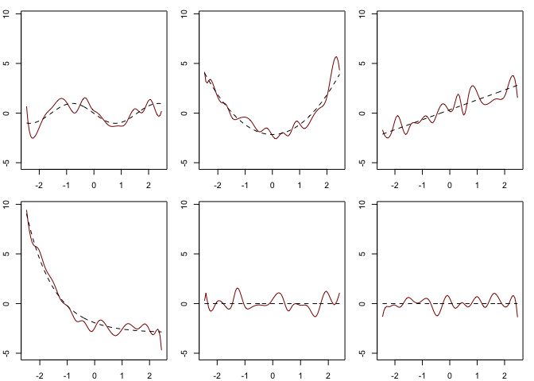
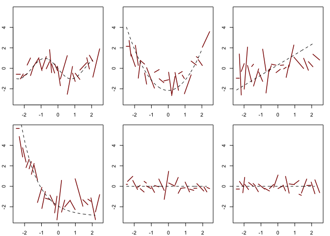
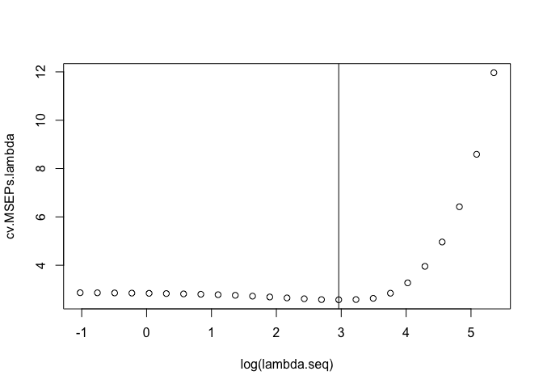
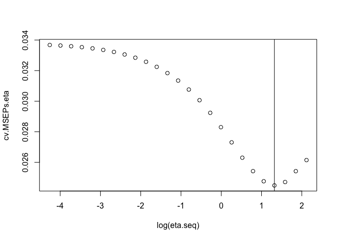
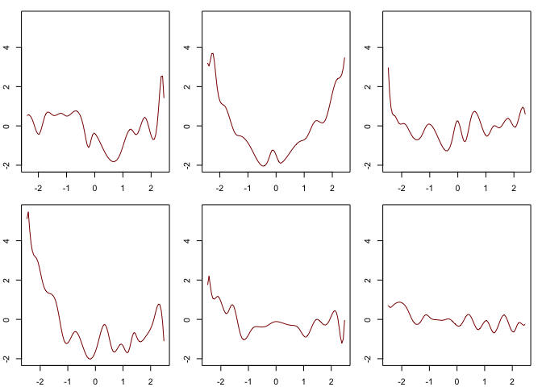
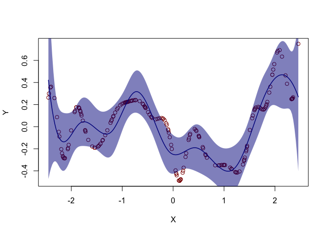
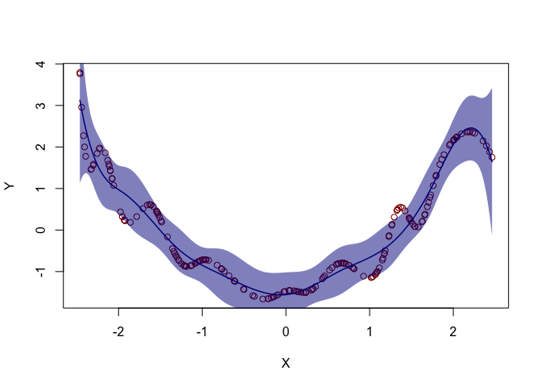
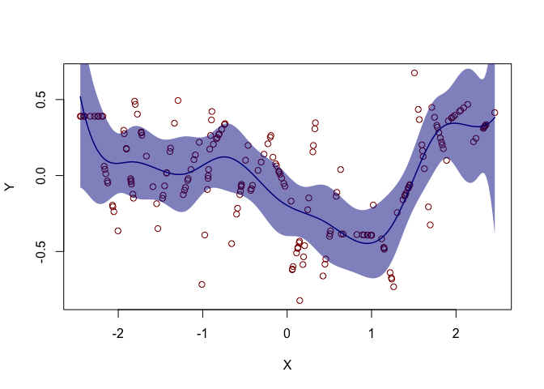
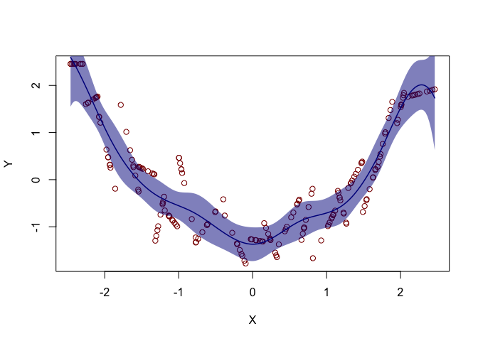

Fit two-step estimator for inference in sparse high-dimensional additive
models.

This is an R package which accompanies the paper:

Karl Gregory. Enno Mammen. Martin Wahl. “Statistical inference in sparse
high-dimensional additive models.” Ann. Statist. 49 (3) 1514 - 1536,
June 2021. <https://doi.org/10.1214/20-AOS2011>

Install with the R commands:

    ## Loading required package: splines

    ## Loading required package: grplasso

    install.packages("devtools")
    devtools::install_github("gregorkb/spaddinf")

## Introduction

*Y* = *f*1(*X*1) + … + *f**q*(*X**q*) + *ε*,
where we assume 𝔼*Y* = 0 and 𝔼*f**j*(*X**j*) = 0
for all *j* = 1, …, *q*.

The estimator of *f**j* is constructed in two steps:

-   First, an undersmoothed presmoothing estimator
    *f̂**j*(pre) of *f**j* is obtained.
-   Second, a less-wiggly smoother is applied to the evaluations of
    *f̂**j*(pre) at the design points.

## Pre-smoother functions

The two functions `spadd.presmth.Bspl` and `spadd.presmth.Legr` are for
obtaining the presmoothing estimators; they construct the presmoothing
estimators from cubic B-spline and Legendre polynomial bases,
respectively.

It is computationally expensive to compute the presmoothing estimator
*f̂**j*(pre) for all *j* = 1, …, *q* when *q* is
large. Therefore, both of these functions take an argument `n.foi` with
which the user may specify the *number of functions of interest* for
which to obtain the presmoothing estimator. For example, `n.foi = 5`
will cause the presmoothing estimators for the first 5 components
(corresponding to the first 5 columns of the design matrix) to be
returned.

The following code uses the function `data_gen` to generate data
according to the simulation design in Gregory et al. (2021) and then
obtains the presmoothing estimators for the first 6 components. The
argument `d.pre` is the number of basis functions to be used for fitting
each component. The arguments `lambda` and `eta` are for the tuning
parameters *λ* and *η* from the paper.

The output is plotted with the function `plot_presmth_Bspl`.

    library(spaddinf)

    # generate some data as in Gregory et al. (2020)
    data <- data_gen(n = 200, q = 10, r = .5)

    # obtain presmoothing estimators for first 6 components
    spadd.presmth.Bspl.out <- spadd.presmth.Bspl(X = data$X,
                                                 Y = data$Y,
                                                 d.pre = 20,
                                                 lambda = 1,
                                                 eta = 3,
                                                 n.foi = 6)
    # make plots
    plot_presmth_Bspl(spadd.presmth.Bspl.out,
                     true.functions = list( f = data$f,
                                            X = data$X))

The following code does the same as the previous code, but constructs
the presmoothing estimators from Legendre polynomial bases. Note the
additional argument `K` for choosing the order of the Legendre
polynomials; the default is `K=1`, which results in piecewise linear
functions.

    # obtain presmoothing estimators for first 6 components
    spadd.presmth.Legr.out <- spadd.presmth.Legr(X = data$X,
                                                 Y = data$Y,
                                                 d.pre = 20,
                                                 lambda = 1,
                                                 eta = 3,
                                                 n.foi = 6,
                                                 K = 1)
    # make plots
    plot_presmth_Legr(spadd.presmth.Legr.out,
                     true.functions = list( f = data$f,
                                            X = data$X))

## Cross-validation for pre-smoother

The functions `spadd.presmth.Bspl.cv` and `spadd.presmth.Legr.cv` make
choices of the tuning parameters *λ* and *η* from grids of values, while
constructing the presmoothing estimators from cubic B-spline and
Legendre polynomial bases, respectively.

Rather than searching over a 2-dimensional grid for the best (*λ*,*η*)
pair, these functions first select *λ* in order to minimize
crossvalidation prediction error for
*f̂*1*L* + … + *f̂**q**L* (see
section 3.1 of the paper), and then select *η* by minimizing the average
crossvalidation prediction error for
*Π̂*−1*L**b**j*1, …, *Π̂*−1*L**b**j**d*,
where *d* is `d.pre`, the number of basis functions (see Section 3.3 of
the paper). To reduce computation time, *η* is only chosen for *j* = 1
(this could be easily changed in the code).

The user specifies by the arguments `n.lambda` and `n.eta` the number of
*λ* and *η* values to consider. Grids of values are constructed on a
logarithmic scale (see code).

The following code generates data according to the simulation design in
Gregory et al. (2020) and uses the function `spadd.presmth.Bspl.cv` to
choose *λ* and *η* using crossvalidation for the cubic B-spline
presmoother. The crossvalidation code takes a couple of minutes to run.
The values chosen in crossvalidation are then given to the function
`spadd.presmth.Bspl` so that the presmoothing estimator can be obtained.
Some plots of the output are generated.

    # generate some data as in Gregory et al. (2020)
    data <- data_gen(n = 150,q = 30,r = .9)

    # get CV choices of lambda and eta: takes a couple of minutes to run
    spadd.presmth.Bspl.cv.out <- spadd.presmth.Bspl.cv(X = data$X,
                                                       Y = data$Y,
                                                       d.pre = 15,
                                                       n.lambda = 25,
                                                       n.eta = 25,
                                                       n.folds = 5,
                                                       plot = TRUE)

    ## [1] "lambda fold: 1"
    ## [1] "lambda fold: 2"
    ## [1] "lambda fold: 3"
    ## [1] "lambda fold: 4"
    ## [1] "lambda fold: 5"
    ## [1] "eta fold: 1"
    ## [1] "eta fold: 2"
    ## [1] "eta fold: 3"
    ## [1] "eta fold: 4"
    ## [1] "eta fold: 5"

    # obtain presmoothing estimators for first 6 components                                                    
    spadd.presmth.Bspl.out <- spadd.presmth.Bspl(X = data$X,
                                                 Y = data$Y,
                                                 d.pre = 20,
                                                 lambda = spadd.presmth.Bspl.cv.out$cv.lambda,
                                                 eta = spadd.presmth.Bspl.cv.out$cv.eta,
                                                 n.foi = 6)
    # make plots
    plot_presmth_Bspl(spadd.presmth.Bspl.out)

## Two-step estimator

The functions `spadd.presmth.Bspl.Bspl` and `spadd.presmth.Legr.Bspl`
compute the two-step estimators when the presmoothers are constructed
with cubic B-spline and Legendre polynomial bases, respectively, with
the resmoothers constructed from cubic B-spline bases.

The user provides `d.pre`, which is as before, and, optionally, `d.re`,
which is the number of functions in the bases used for resmoothing. If
`d.re = NULL`, then this is chosen using a crossvalidation procedure.
Values of *λ* and *η* for constructing the presmoothers must be
provided. Setting `plot = TRUE` produces plots of each resmoother with
(1−*α*)100% pointwise confidence intervals of the form in equation (14)
of the paper, where *α* is specified by the argument `alpha`. The red
circles in the plots are the values of the presmoothing estimators at
the design points.

The code below demonstrates this.

    # generate some data as in Gregory et al. (2020)
    data <- data_gen(n = 200, q = 50, r = .9)

    # get two-step estimator with B-spline presmoother and B-spline resmoother
    preresmth.Bspl.Bspl.out <- preresmth.Bspl.Bspl(Y = data$Y,
                                                   X = data$X,
                                                   d.pre = 20,
                                                   d.re = 10,
                                                   lambda = 1,
                                                   eta = 3,
                                                   n.foi = 2,
                                                   plot = TRUE,
                                                   alpha = 0.05)

    # get two-step estimator with Legendre polynomial presmoother and B-spline resmoother
    preresmth.Legr.Bspl.out <- preresmth.Legr.Bspl(Y = data$Y,
                                                   X = data$X,
                                                   d.pre = 20,
                                                   d.re = 10,
                                                   lambda = 1,
                                                   eta = 3,
                                                   n.foi = 2,
                                                   plot = TRUE,
                                                   alpha = 0.05)

